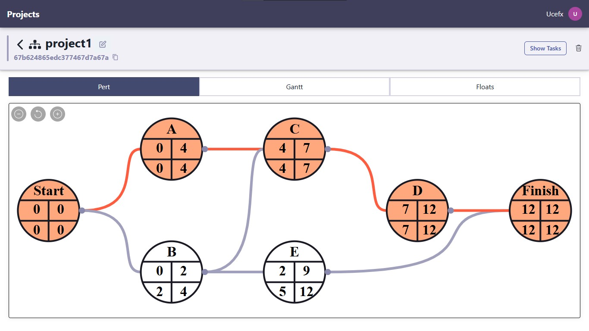
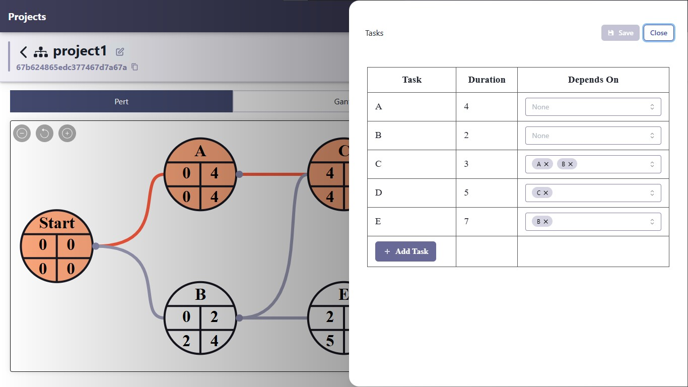
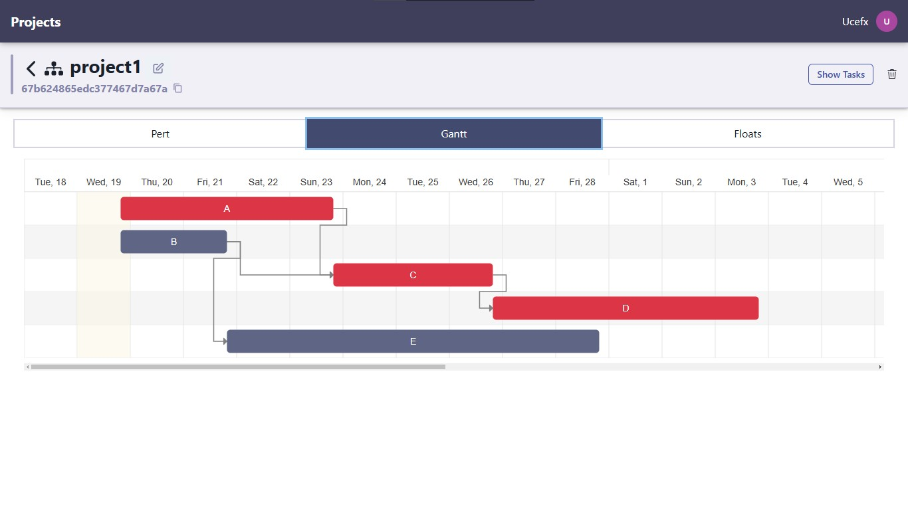
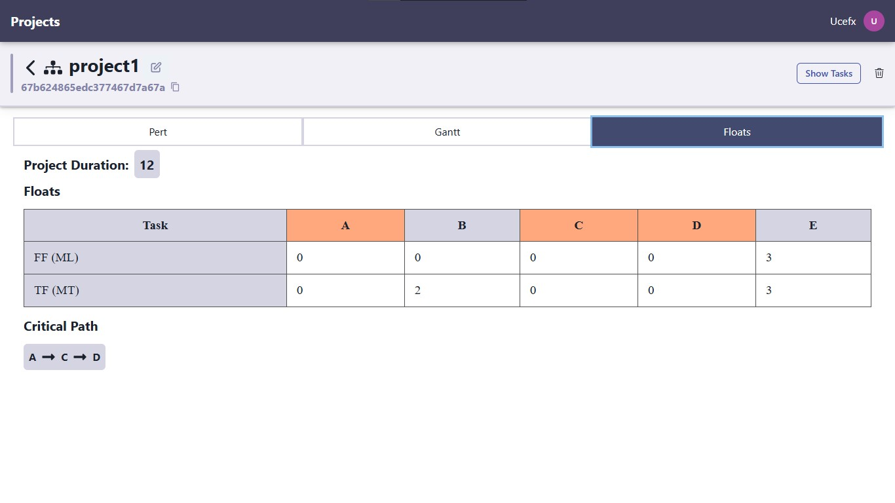
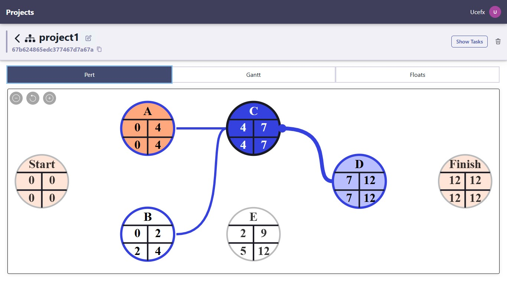

<h1 align="center">PERT</h1>

<p align="center">
    
</p>

## :pencil: Description

Implemented the core PERT algorithm, calculating task durations, slack time, and identifying critical paths for project management. 

Developed an algorithm for dynamically drawing the PERT chart on a canvas, ensuring accurate node positioning and dependency mapping.

## :rocket: Technologies

-   [ReactJS](https://react.dev/)
-   [NodeJS](https://nodejs.org/en/)
-   [ExpressJS](https://expressjs.com/)

## :book: How to use

To clone and run this application, you'll need [Git](https://git-scm.com/downloads) and [NodeJS](https://nodejs.org/en/download/) installed on your computer. From your command line:

Clone this repository

```
git clone https://github.com/youcefhmd/pert.git
```

Go into repository

```
cd pert
```

Install dependencies (client and server)

```
cd client
npm install
```

```
cd ../server
npm install
```

Run the app (client and server) each in a separate terminal

```
npm start
```
## :camera: Screenshots





